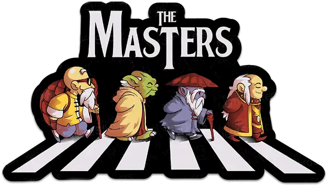

## Olá Mundo 🌎, eu sou <a href="https://www.linkedin.com/in/brunokobi"> Bruno Kobi Valadares de Amorim.</a> 

    
  <h3 align="left"> 🎓 Formação 🎓 </h3>
  <h5 align="left">🚀 Técnico em Informática - IFES
  
  
  
  
 🚀 Bacharel de Sistemas de Informações - UniSales
     
  🚀 Mestrando em Computação Aplicada em Inteligência Artificial - IFES 
  
  </h5>  
  
 
  

  
  ##

  

  

  
  

 
  <h3 align="left"> 💻 Tecnologias 👨‍💻 </h3>

  
  
   
     
   
   
   
      
   
    <b style="color=green">PROLOG</b>
    
    

   
   
  
   
   
   
   
  
   
   
   
   
   
   
   
   
   

   

 <h3 align="left"> ☎️ Contatos: 📣 </h3>

 
  
  
   
  
   
     

  
  

  
  
  

